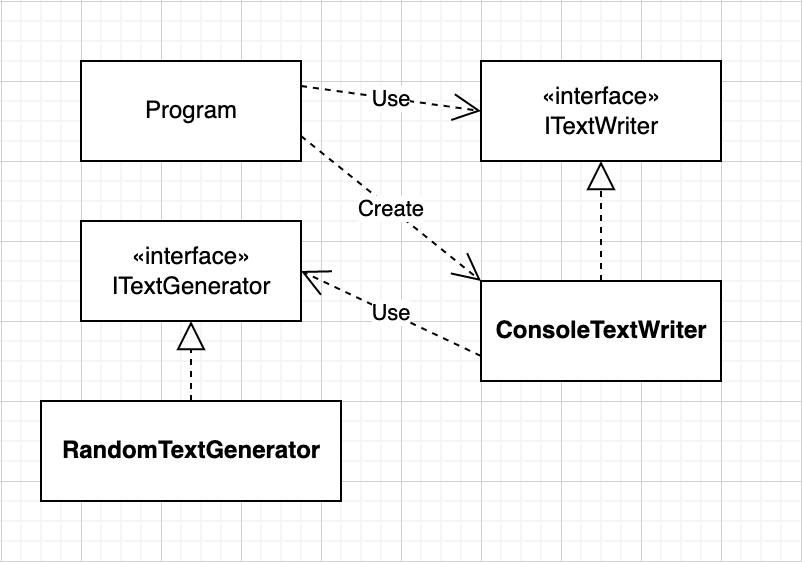

# IocTests

Hey, how do you test your IoC config? You don't? Maybe you can use this solution as inspiration or template.

Find out more in my german blog article ["Unit-Tests für IoC Container"](https://gerrit.codes/posts/2022/02/unit-tests-f%C3%BCr-ioc-container/)

## Overview

When the program (see [Program.cs](src/ConsoleApp/Program.cs)) starts, the interface ITextWriter is resolved. The registered implementation ConsoleTextWriter with all its dependencies (in this case ITextGenerator) must be registered in the IoC container. You can find the IoC configuration in the file [IocConfig.cs](src/ConsoleApp/Ioc/IocConfig.cs).

## Build, run, and test

Prerequisites: .NET 6

You can easily build and test the solution with `dotnet test`.
